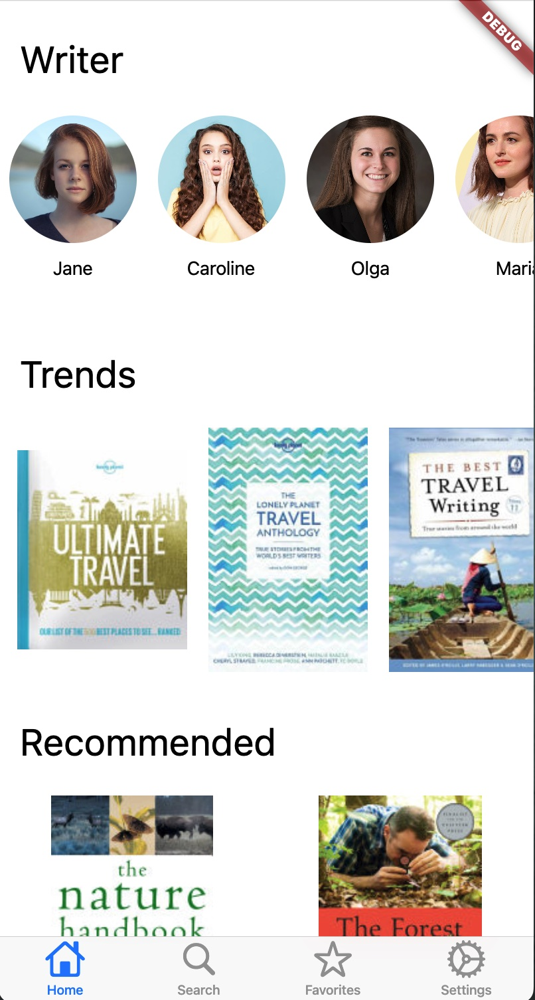
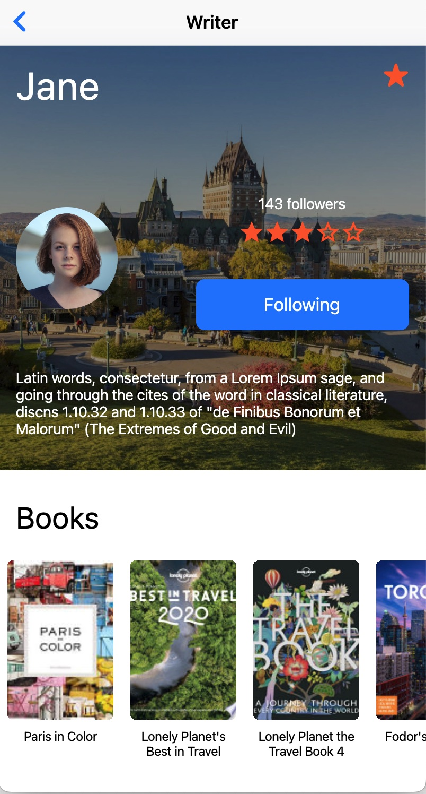
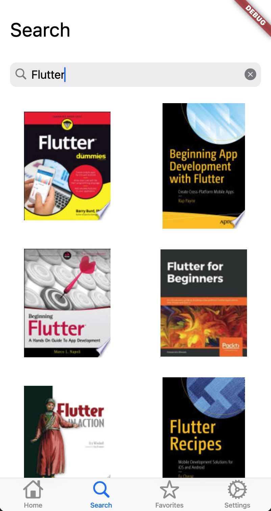
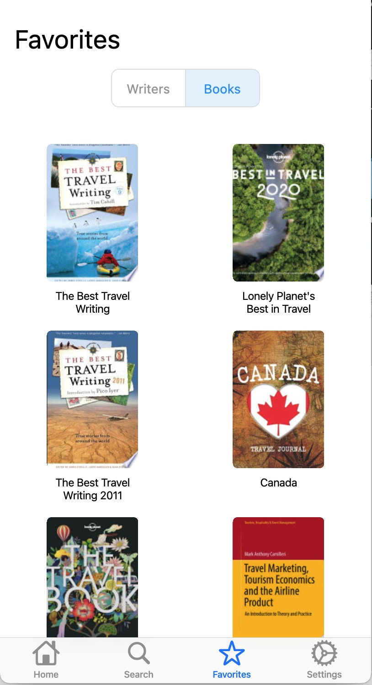

# Bookclub

This is a simple flutter app. It has been built using the  BloC, GetIt, Dio, GoRouter and some concepts of clean code/arch.
This project is just a demo. Don't use it in production.

## Mobile

## Desktop
### Home

### Writer Details

### Book Details

### Favorites

